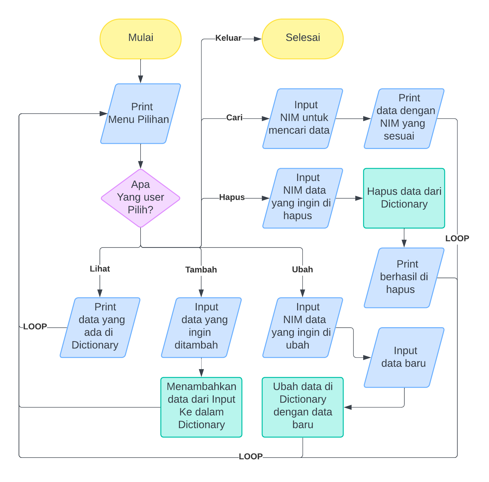
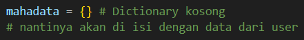
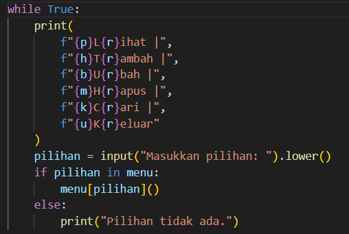
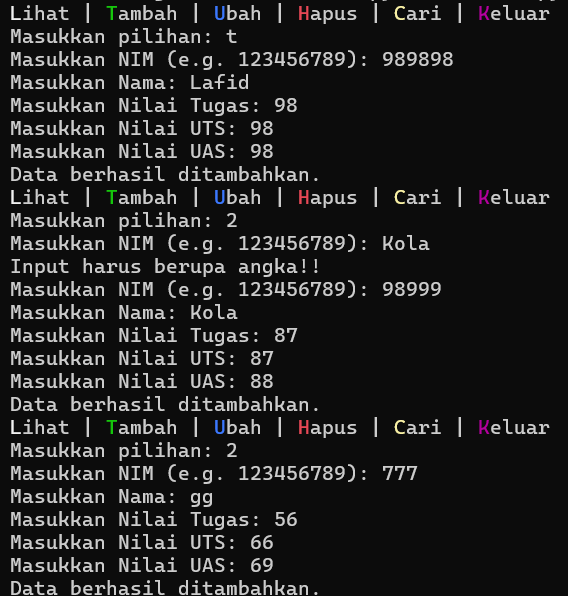
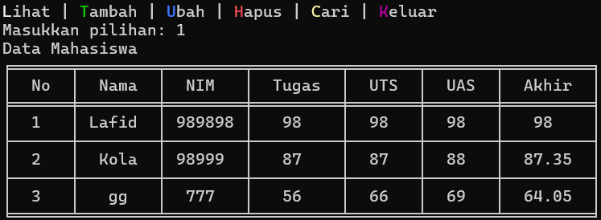
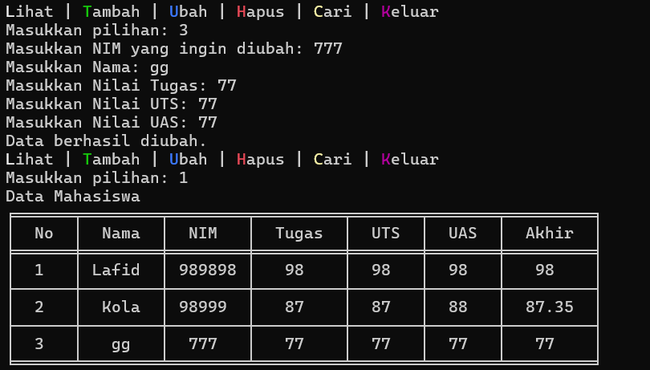
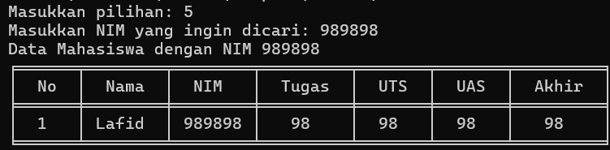
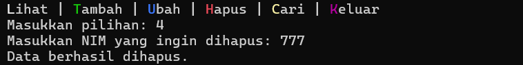
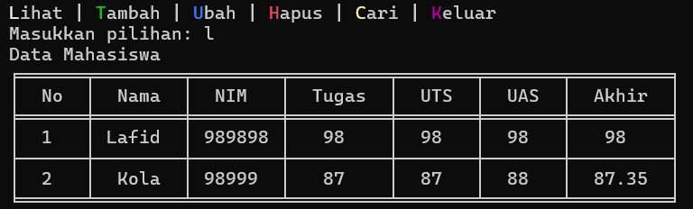

# Program Data Nilai Mahasiswa

# Cara Kerja Program Ini
1. Menampilkan menu kepada pengguna.
2. Meminta pengguna untuk memilih salah satu opsi.
3. Memanggil fungsi yang sesuai dengan pilihan pengguna.
4. Mengulang langkah 2 sampai pengguna memilih opsi keluar.

# Gambaran Flowchart


# Struktur Kode

### Modul

Program ini menggunakan modul Tabulate untuk menampilkan tabel data kepada pengguna.

### Dictionary


sebagai tempat untuk menyimpan setiap data yang diinputkan.

### Fungsi-Fungsi
```ruby
def tabel(data, headers=None, title=""):
# fungsi ini menggunakan modul tabulate untuk mencetak table data
    if not data: 
        table = [["Tidak ada data"]]
        print(tabulate(
            table, 
            headers =["Tidak ada data"], 
            tablefmt="fancy_grid", 
            colalign=("center",)
            ))
        return
    if headers is None:
        headers = ["No", "Nama", "NIM", "Tugas", "UTS", "UAS", "Akhir"]
    table = []
    for i, NIM in enumerate(data, start=1):
        row = [
            i, 
            data[NIM]["Nama"], 
            NIM, 
            data[NIM]["Nilai Tugas"], 
            data[NIM]["Nilai UTS"], 
            data[NIM]["Nilai UAS"], 
            data[NIM]["Nilai Akhir"]
            ]
        table.append(row)
    print(f"{title}")
    print(tabulate(
        table, 
        headers, 
        tablefmt="fancy_grid", 
        colalign=("center",)*7
        ))

def nilai(str):
# fungsi untuk memastikan input adalah angka
# dan mengulangi permintaan jika input bukan angka
# juga membatasi nilai dari input itu
    while True:
        try:
            poin = float(input(str))
            if poin < 0 or poin > 100:
                print(f"Nilai harus berkisar dari 0 hingga 100.")
            else:
                return poin
        except ValueError:
            print("Input harus berupa angka!!")    

def nim_adalah(str, harus_ada=True):
# fungsi ini akan meminta input NIM dari user
# melihat apakah NIM tersebut ada di database atau tidak
# dan mengulangi permintaan jika input bukanlah angka
# karna NIM adalah Nomor Induk Mahasiswa
    while True:
        try:
            NIM = int(input(str))
            if harus_ada and NIM not in mahadata:
                print("NIM tidak ditemukan!")
            elif not harus_ada and NIM in mahadata:
                print("NIM sudah ada di database. Masukkan NIM lain!")
            else:
                return NIM
        except ValueError:
            print("Input harus berupa angka!!")    
    
def minta(NIM):
# fungsi minta input
    nama = input("Masukkan Nama: ")
    tugas, uts, uas = map(nilai, [
        "Masukkan Nilai Tugas: ", 
        "Masukkan Nilai UTS: ", 
        "Masukkan Nilai UAS: "
        ])
    akhir = (tugas*0.3) + (uts*0.35) + (uas*0.35)
    return {
        "Nama": nama,
        "NIM": NIM,
        "Nilai Tugas": tugas,
        "Nilai UTS": uts,
        "Nilai UAS": uas,
        "Nilai Akhir": akhir
    }
 
def lihat():
# fungsi untuk menampilkan data yang ada di dictionary
    tb.tabel(mahadata, title="Data Mahasiswa") 

def tambah():
# fungsi yang akan menambahkan data yang sudah diterima fungsi minta
# ke dalam dictionary
    NIM = nim_adalah("Masukkan NIM (e.g. 123456789): ",harus_ada=False)
    mahadata[NIM] = minta(NIM)
    print("Data berhasil ditambahkan.")

def ubah():
# fungsi akan mencari data dengan NIM yang sesuai
# kemudian meminta input data baru
# input tersebut akan menggantikan data yang sudah ada
    NIM = nim_adalah("Masukkan NIM yang ingin diubah: ")
    mahadata[NIM] = minta(NIM)
    print("Data berhasil diubah.")

def hapus():
# fungsi ini gunanya untuk hapus data dari dictionary
    NIM = nim_adalah("Masukkan NIM yang ingin dihapus: ")
    del mahadata[NIM]
    print("Data berhasil dihapus.")
  
def cari():
# akan mencari dengan NIM
# data dengan NIM tersebut akan ditamplikan kepada user
    NIM = nim_adalah("Masukkan NIM yang ingin dicari: ")
    tb.tabel({NIM: mahadata[NIM]}, title=f"Data Mahasiswa dengan NIM {NIM}")
```

### Menu

Program akan terus menampilkan menu kepada pengguna sampai opsi keluar di pilih. Setiap opsi akan memanggil fungsi yang sesuai.


# Output Dari Program Ini


Menambahkan data


Menampilkan tabel data


Mengubah data


Mencari 



Menghapus data


Keluar