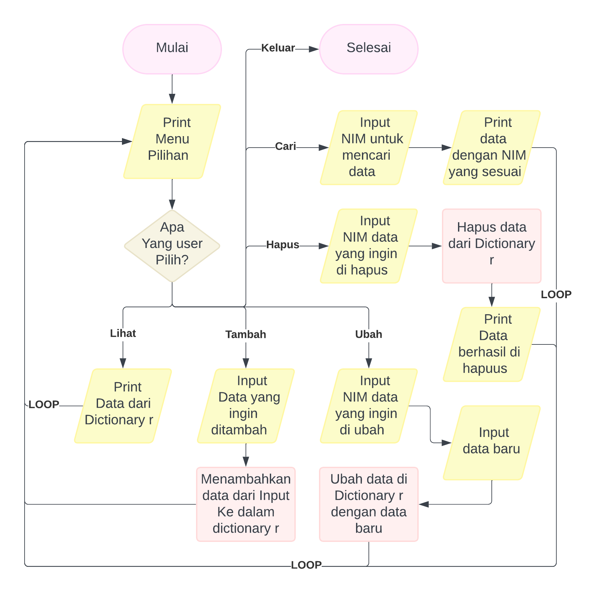
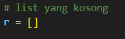
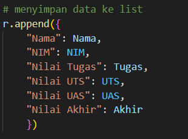

# Program Input Data

# Cara Kerja Program Ini
1. Untuk memastikan input adalah angka desimal atau float, program mendefinisikan fungsi ```nilai(str)```.
2. Program membuat list kosong ```r``` untuk menyimpan data.
3. Dalam loop utama, program meminta nama pengguna, NIM, nilai tugas, nilai UTS, dan nilai UAS. 
4. Program kemudian menghitung nilai akhir berdasarkan bobot nilai: tugas 30%, UTS 35%, dan UAS 35%. 
5. Data yang telah dimasukkan disimpan kedalam ```r```, dan pengguna diminta untuk menentukan apakah mereka ingin menambah data lagi. Loop berhenti jika input adalah (t).
6. Setelah loop selesai, program mencetak tabel yang berisi data yang telah dimasukan, termasuk nilai akhir.

# Gambaran Flowchart


# Blok Kode

### Fungsi

Ini bertujuan untuk memberikan loop ke setiap permintaan input, memastikan input adalah angka dan mengulang kembali permintaan jika input bukan lah angka.
### Dictionary

sebagai tempat untuk menyimpan setiap data yang diinputkan.
### Loop

### Menambahkan data

### Mencetak Tabel

menggunakan format ```:^ .1f```
untuk melebarkan output, ```^``` text akan berada ditengah-tengah, ```.1f``` untuk memendekan nilai float.

https://gist.github.com/rene-d/9e584a7dd2935d0f461904b9f2950007